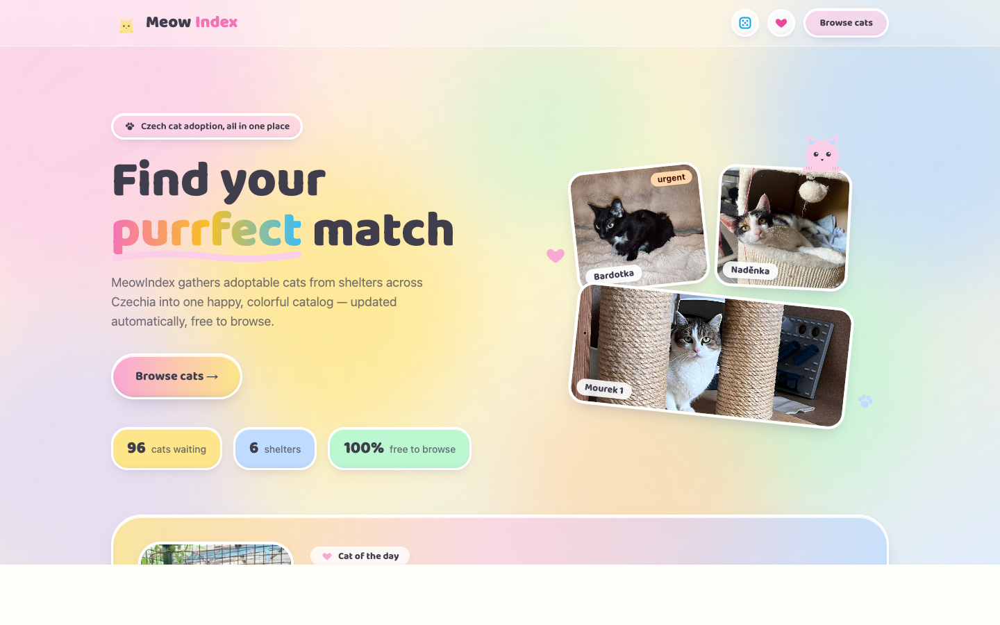

# MeowIndex 🐱

**Find your purrfect match.** MeowIndex gathers adoptable cats from shelters
across Czechia into one happy, colorful catalog — kept fresh automatically by
an AI scraper, and free to browse.

🐾 **Live:** https://meowindex.vercel.app

## What it does

- **One catalog for many shelters.** Cats from six Czech shelters (and
  counting) in a single place, with search, filters, sorting and favorites.
- **AI-powered scraping.** An LLM reads each shelter's website — no per-site
  parsers. It extracts every cat, normalizes ages, translates the cats'
  stories into English, and detects when a cat gets adopted.
- **Always up to date.** Re-scrapes are incremental: unchanged pages cost
  nothing, changes flow into the catalog within minutes of a run.
- **Adopt responsibly.** A built-in [guide](https://meowindex.vercel.app/adopt)
  on making adoption calm and stress-free for the cat.
- **Public REST API.** All data is available through a free, documented API —
  see the [Swagger docs](https://meowindex-production.up.railway.app/docs).

## Highlights

- 🎲 Feeling lucky? The dice in the navbar jumps to a random cat.
- ❤️ Save favorites locally — no account needed.
- 🐈 A "Cat of the day", a shelter map of Czechia, and 30 rotating cat facts.
- 🔍 Filter by age, gender, location, shelter, personality tags — or surface
  the **urgent** and **longest-waiting** cats first.

## Under the hood

FastAPI + PostgreSQL backend with an Anthropic Claude–powered scraper, and a
Next.js 14 frontend with a pastel claymorphism design. Hosted on Railway
(API + DB) and Vercel (web).

📚 **All technical documentation lives in [`docs/`](docs/README.md)** —
architecture, API reference, scraper internals, frontend, deployment and local
development guides.

🏆 **Hackathon submission:** see [SUBMISSION.md](SUBMISSION.md).

---

*Data is aggregated from public shelter websites. Every cat links back to its
shelter — that's where adoption actually happens. Please adopt responsibly.* 🐾
